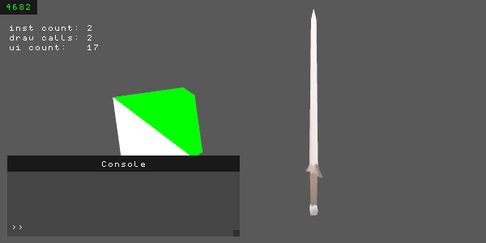

# mini
Base framework for my games, ui and multimedia projects. 
Intended to show my experience with programming in C++ and software engineering.
It is not intended to be a "plug in and play" library. 

### Contents
- Custom STL (Array, String, Map, Bitset)
- Memory allocation (some CTFE)
- Logger and profiler (HTML memory print out)
- Math and algorithms (Matrix, Quaternion)
- Window and input event system
- Vulkan renderer and immediate GUI
- Other utils

This is Work In Progress! 

## How to run?
- I am using VS Code with some C++ extensions
- Batch files are included to fire up the compiler MSVC
- Need of C++20 (heavy use of "designated initializers" for Vulkan)

# Rationale

## Custom STL
The std is hard to read and hard to extend (e.g. using std::vector with your custom allocator).
So I decided to roll my own containers and memory allocation.

### mini::box::Array
- fixed size (capacity-based with internal count)
	- (vs) auto growth can be harmful on perf (reallocations), can lead to ptr invalidation and makes it harder to use with custom allocators
	- simple inheritance (without vtable) is used so the (abstract) base can be passed around without the need of writing Array<T, N> everywhere
	- wrapper and elements are not seperated in memory and the whole object can simply be passed to an allocator
	- AppendArray() can be used to resize or convert an array 
- no ctor calls when initializing the array (underlying byte array)
- array is usable with enums (no cast by the user needed)
- bounds checking is toggleable via macro, no exceptions are used
- removal of elements can be done fast (swapping) or slow while preserving order

### mini::mem::Allocate()
- global functions
- compile time (capacity based system)
    - user defines blocks at compile time in one place (see array ALLOC_INFOS[])
    - when claiming memory, the appropriate block size will be figured out at compile time
- BlockPtr
    - is returned when claiming memory
    - holds data about the used block and will "free" the block when destroyed (RAII)
- free / used blocks are represented by one bitset
- printable as HTML

## Vulkan
General structure:
- Context   (Instance, PhysicalDevice, LogicalDevice, Meta, Debug)
- Resources (Pipeline, Shader, Renderpass, Synchronization, ...)
- Rendering (Command recording, presentation loop)
- Wrappers 
